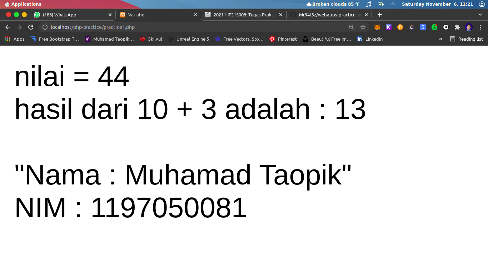
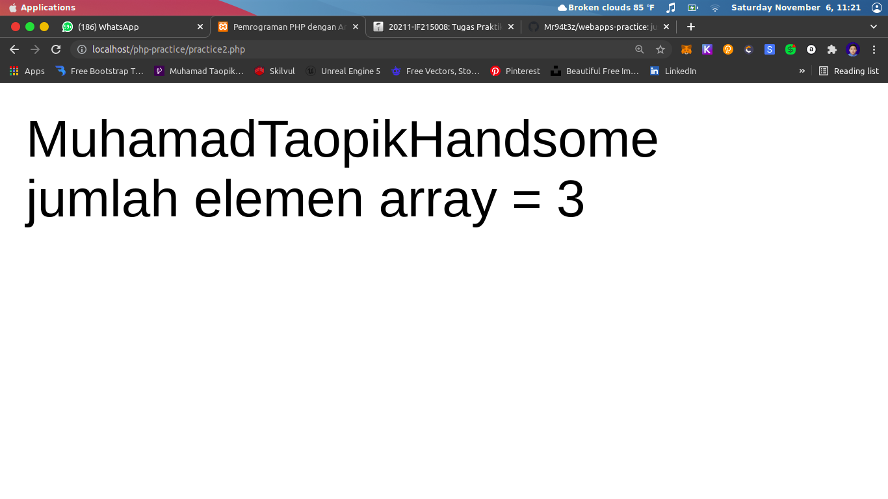
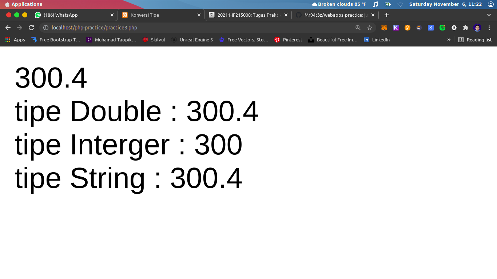
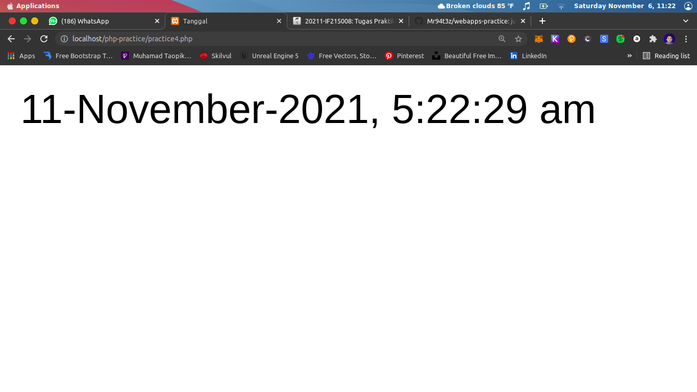
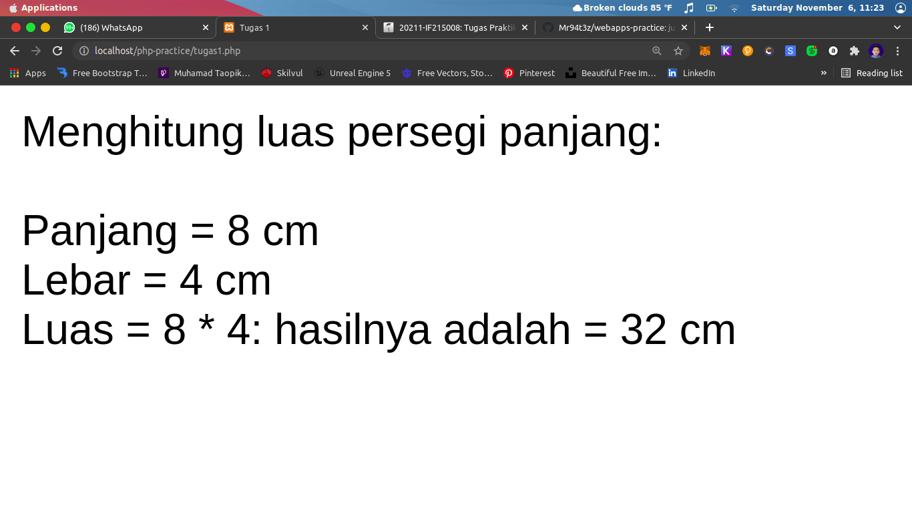
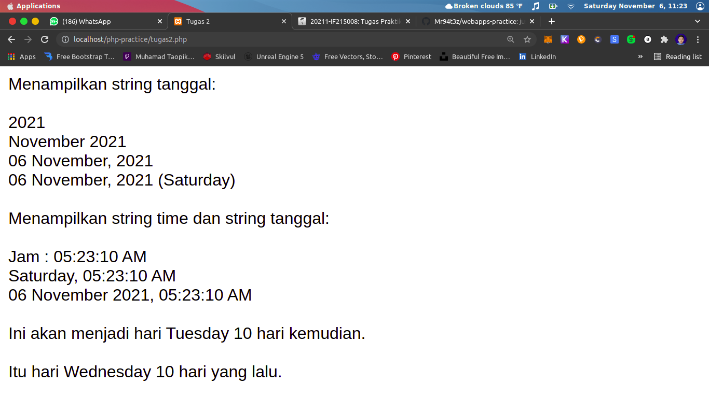
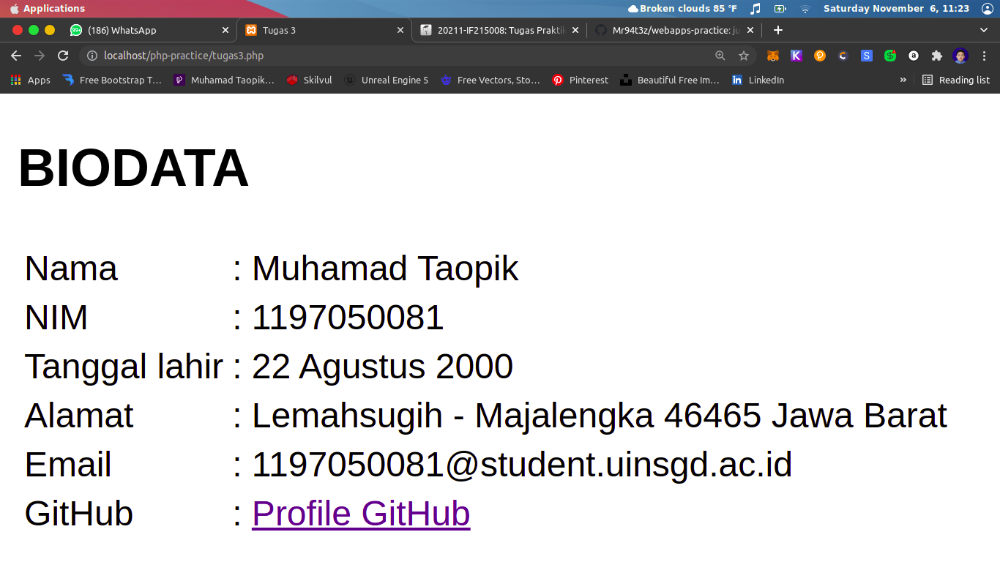

# WebApps Practice


```
My name's Muhamad Taopik.
It's just practice.
Y'all can clone whatever do u want!
```

# Simple Calcucator Without CSS


# Layout Preview With Bootstraps


<h4>1. Home Layout</h4>


<h4>2. Convert Layout</h4>


<h4>3. Calculator Layout</h4>


# PHP Programming 


## PHP Practice


<h4>1. Practice 1</h4>



<h4>2. Practice 2</h4>



<h4>3. Practice 3</h4>



<h4>4. Practice 4</h4>



## PHP Task


<h4>1. Task 1</h4>



<h4>2. Task 2</h4>



<h4>3. Task 3</h4>



# Last But Not Least

```
run!
```
